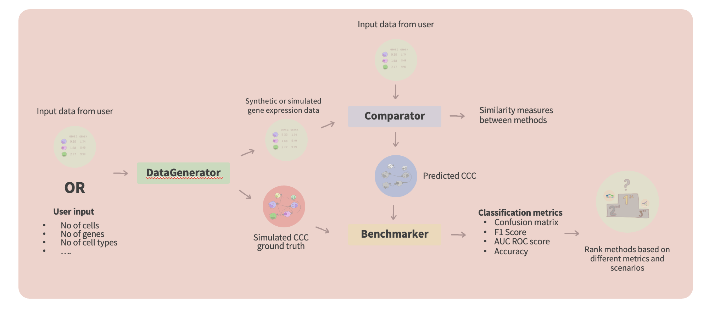

# benCCChmarker


[](https://codecov.io/gh/hariesramdhani/benccchmarker)


**benCCChmarker** is a Python framework to benchmark multiple single-cell RNA-seq cell-to-cell communication algorithms. **benCCChmarker** provides an easy to use framework to compare different algorithms using simulated cell-to-cell communcation single-cell RNA-sequencing data and curated data.

## Features (v 0.0.1)

- **Run Multiple Methods**: Run multiple CCC algorithms at once on a user specified input.
- **Benchmarking**: Compare the performance of various cell-to-cell communication algorithms on metrics such as accuracy, scalability and robustness.
- **Extensibility**: Easily add new algorithms to the benchmarking suite.
- **Visualisation**: Generate comprehensive visual reports of the benchmarking results.
- **Reproducibility**: Ensure reproducible results with detailed logging and configuration management.

## Installation

### Installing directly from the repository
Installing from this repository allows you to use the development version of benCCChmarker
```sh
git clone https://github.com/MorganResearchLab/benccchmarker.git
cd benccchmarker

# Create a conda environment (this will install the 
# minimum dependencies for the environment)
conda env create -f environment.yaml

# Activate the environment
conda activate benccchmarker

# Install benccchmarker
pip install .
```

### Installing from conda
(in progress)

## Basic Usage

A standard benchmarking pipeline using `benccchmarker` is illustrated in the diagram above. Typically, you start with generating simulated data injected with CCC information using `DataGenerator`, followed by running the `Comparator` to run different methods on the simulated data and finally, you compare the inferred CCC to the generated ground truth using `Benchmarker`. More tutorials and API information will be available here [https://www.morganlab.co.uk/benccchmarker]

### `DataGenerator`
`DataGenerator` allows you to generate simulated data both de novo and from reference

#### Generating de novo simulated data
```python
output_path = "tmp/data_generator_output"
data_generator = DataGenerator()

num_cells = 1000
num_genes = 100
num_lr_pairs = 10

data_generator.simulate_denovo(
    num_cells=num_cells,
    num_genes=num_genes,
    num_lr_pairs=num_lr_pairs,
    output_path=output_path,
    add_control=True
)

simulated_data_path = f"{input_path}/simulated_data.h5ad"

adata = anndata.read_h5ad(simulated_data_path)
```

#### Generating simulated data from reference
```python
output_path = "tmp/data_generator_output"
reference_data_path = "<LOCATION_OF_THE_REFERENCE_ANNDATA>"
adata = anndata.read_h5ad(reference_data_path)

data_generator = DataGenerator()

data_generator.simulate_from_reference(
    adata,
    num_lr_pairs=10,
    overexpression_scale=1.25,
    output_path=output_path,
    output_filename="simulated_data",
)

adata = anndata.read_h5ad(f"{input_path}/simulated_data.h5ad")
```

Running any of the codes above will give the following output files
```bash
ls tmp/data_generator_output
data_params.json                                      
simulated_data_ground_truth.csv
simulated_data.h5ad                                   
simulated_data_non_differential_interaction_maps.json
simulated_data_batch_labels.csv                       
simulated_data_random_factors_for_be.json
simulated_data_batches.csv                            
simulated_data_random_vector_for_be.json
simulated_data_cell_type_markers.json                 
simulated_data_seurat.rds
simulated_data_conditioned_interaction_maps.json      
synthetic_ground_truth.json
simulated_data_differential_interaction_maps.json
```

- `data_params.json`: Parameters used to generate the simulated data
- `simulated_data_ground_truth.csv`: csv file containing the simulated cell-to-cell communication
- `simulated_data.h5ad`: anndata file containing the gene expression, cell_type information, batch and condition of the simulated data
- `simulated_data_non_differential_interaction_maps.json`: json file containg the information of non differential communication (Explained in the details in the docs)
- `simulated_data_random_factors_for_be.json`: json file containing the random factors used to simulate the batch effect
- `simulated_data_cell_type_markers.json`: json file containing cell types and the corresponding genes used to simulate cell type marker
- `simulated_data_seurat.rds`: seurat object containing the gene expression, cell_type information, batch and condition of the simulated data
- `simulated_data_conditioned_interaction_maps.json`: json file containg the information of differential communication (Explained in the details in the docs)

### `Comparator`
Once you have the simulated data, you can use the `Comparator` to run the cell-to-cell communication methods of your choice on the simulated datasets.

```python

BASE_DIR = "."

output_path = "tmp/comparator_output"
adata_file_path = "tmp/data_generator_output/simulated_data.h5ad"

comparator = Comparator(
    adata_file_path=adata_file_path,
    output_file_path=output_file_path,
    species="hsapiens"
)

comparator.run()
```
This will run the comparator with minimal setup (only runs celltalker)

### `Benchmarker`
Finally, if you successfully run the `Comparator` it will give you the output containg the inferences of cell-to-cell communication for the methods that you choose, the next step that you want to do is to use benchmarker to summarise the performance of the methods for you

```python
ground_truth_path = "tmp/data_generator_output"
input_path = "tmp/comparator_output""
output_path = "tmp/benchmarker_output"

benchmarker = Benchmarker(
    ground_truth_file_path = f"{ground_truth_path}/simulated_data_ground_truth.csv",
    prediction_file_path = f"{input_path}/celltaker.csv",
    ground_truth_data_params_path = f"{ground_truth_path}/data_params.json",
    output_dir = output_path
)

benchmarker.run()

benchmarker_result = benchmarker.get_results()
```


